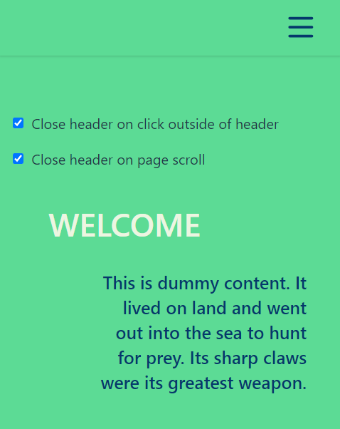
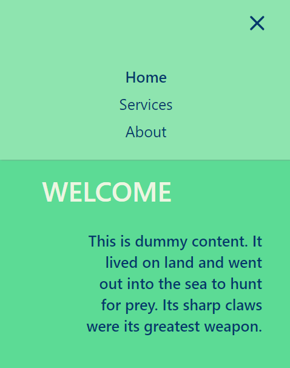

# Dynamic react header

A responsive header made in React.js, with a dropdown menu for small screens.

<p align="center">
  
  
</p>

## Header Features

Responsive :

- big screen → navigation links displayed in center
- small screen → only a burger menu, unfolding dropdown menu on click

Animated :

- dropdown menu folding/unfolding
- burger button : from burger to close icon, from close icon to burger

Dropdown menu folds on link click, on page scroll and on page click.

Links data from a js array (src/assets/navlinks.js)

Header states and functions in src/Layout.jsx, so no need for context provider or redux store.

## Project features

- React powered by [Vite](https://vitejs.dev/)
- [TailwindCss](https://tailwindcss.com/)
- [Styled Components](https://styled-components.com/)
- [react-router and react-router-dom](https://reactrouter.com/en/main)

## Use it !

Download zip or clone repo and...

```bash
  npm i
  npm run dev
```

Happy coding ;)
